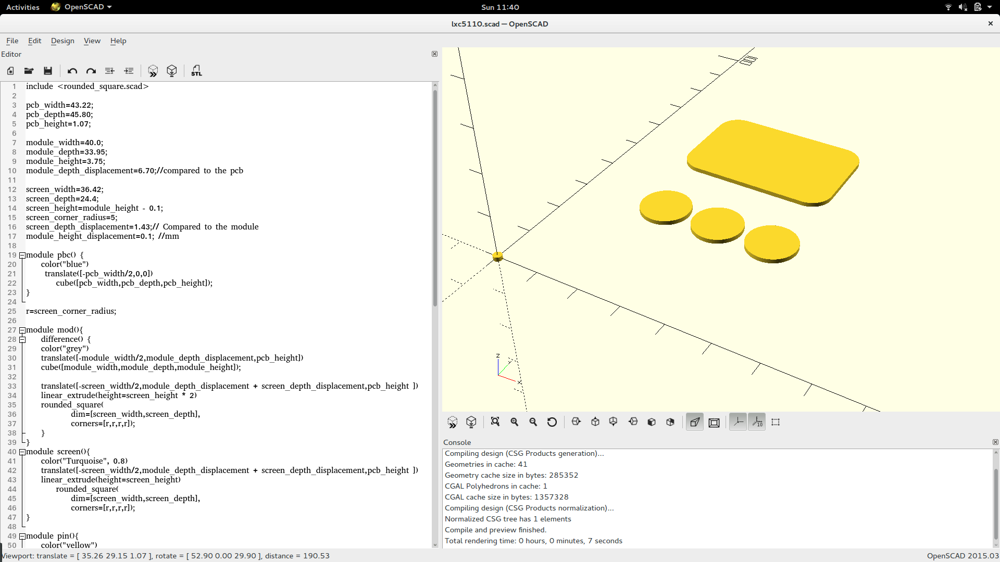
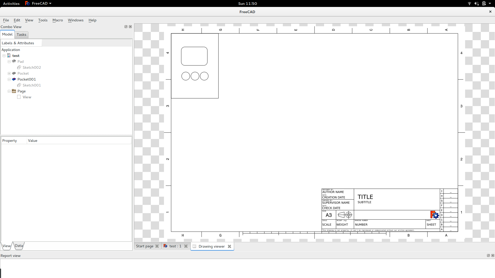

Creating the case
=================

For the initial week-end project I used a drill and a saw to create the initial
case.  The result was sub optimal and not scalable. Having done 3d printing
before I also did not want to 3d print many pieces. I settled for lasercutting.

Creating a design for laser cutting
-----------------------------------

As the design of the lcd display was already done using openscad it seamed like
the logical choice to also use openscad to create lines for creating the laser
cut.

In the end this was the result with the smallest effort. Design using 3d primitives
and use the projection method (and save as dxf to get it in an other program)

Creating a laser cut design using freecad
----------------------------------------

I also tried using Freecad to export dxf files but it was really cumbersome and
I did not find a proper way of doing it.

An other approach I tried and that worked was to export the design as a stl file
and after that do a cut using freecad problem I had with the export

Creating a projection based on a stl file::

	projection()
	import("/home/keesj/pcb.stl");

Edit using inkscape
-------------------

While the tools above allow to create a shape suitable for laser cutting there still are some problems.
First of all all the lines have the same color and laser cut programs often will use color coding to
determine how to convert the lines into a flow and determine the operation to perform (cutting or engraving).

I needed a reference point to be able to position the laser and thus needed different colors. There are a few tools
available (qcad being one of them) the have support for doing this kind of thing but inkscape is also very well suited
for this task.

Tools
-----

https://github.com/jepler/linuxcnc-rosh-laser
using bCNC

quit fast 
