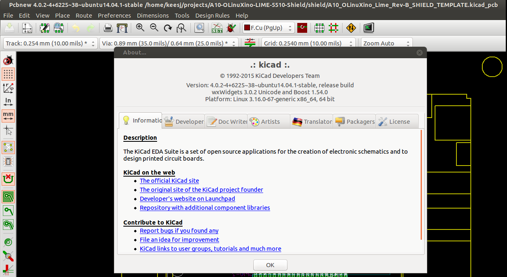

Hardware design
===============

Hardware component selection
----------------------------

After finishing the prototype it was time to start production. This means
to order components in larger quantities and create a PCB to fit the components.

The Initial run will be for 50 pieces but I first stelleld to order parts 
for 10 pieces and ended up only ordering 5 pieces.

The PCB design was to be done using `KiCAD`_ and using the shield template
that was offered by `Olimex`_ on their website/git repo

Software tools
--------------

The machine used during the design was a slightly oder laptop running ubuntu (LTS)::

	keesj@e540:~/projects/A10-OLinuXino-LIME-5510-Shield-gh-pages$ lsb_release -a
	No LSB modules are available.
	Distributor ID:	Ubuntu
	Description:	Ubuntu 14.04.4 LTS
	Release:	14.04
	Codename:	trusty

and I installed KiCAD from the PPA (the KiCAD version in ubuntu is outdated)

/etc/apt/sources.list.d/js-reynaud-kicad-4-trusty.list::
	deb http://ppa.launchpad.net/js-reynaud/kicad-4/ubuntu trusty main

And the version can be seen here

.. _KiCAD: http://kicad-pcb.org/
.. _Olimex: http://olimex.com/
