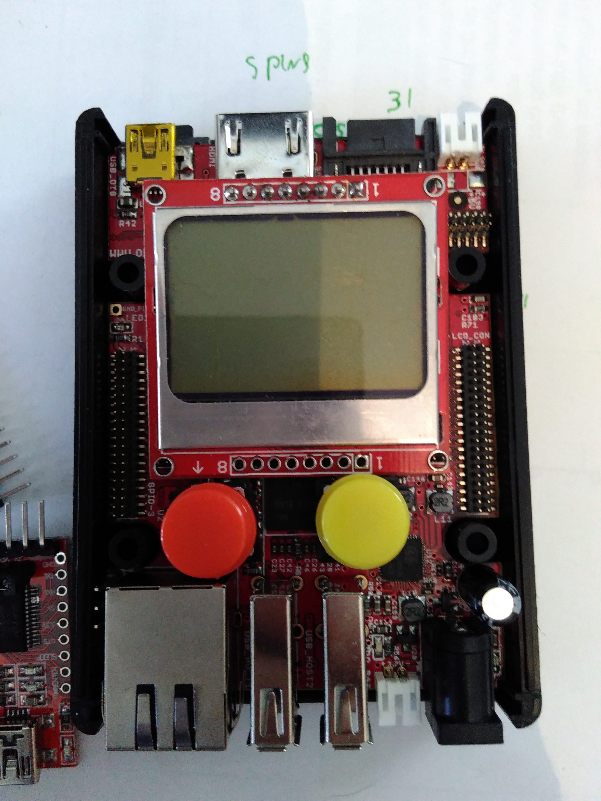
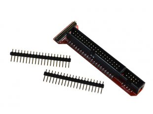
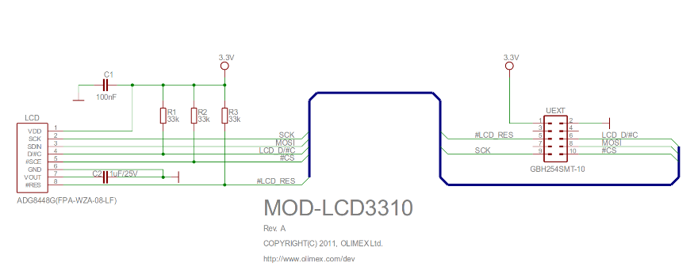
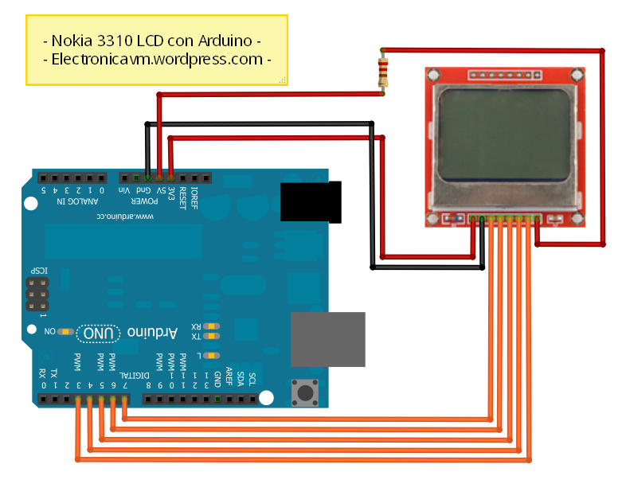
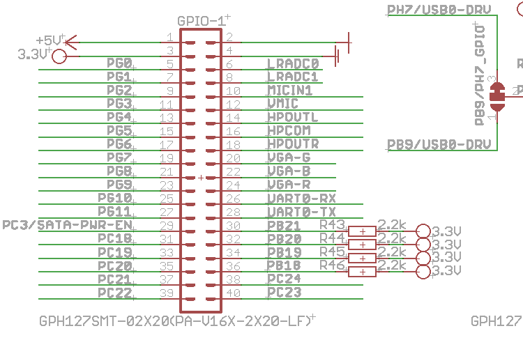
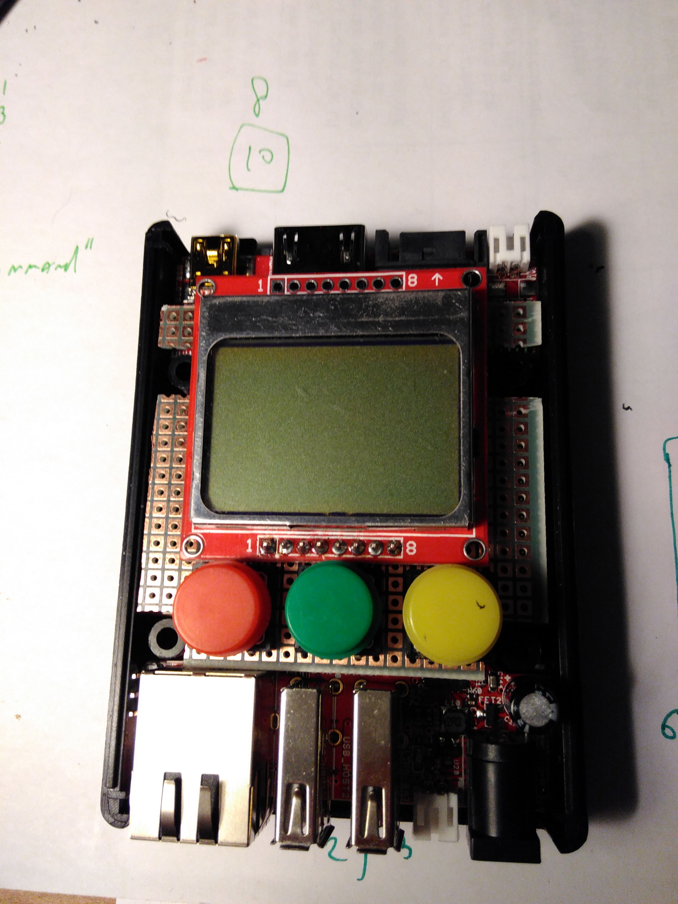
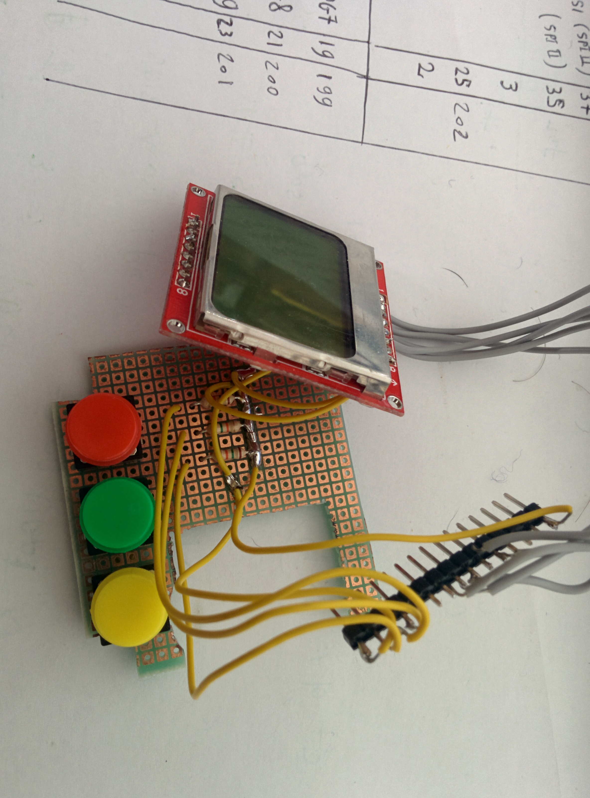
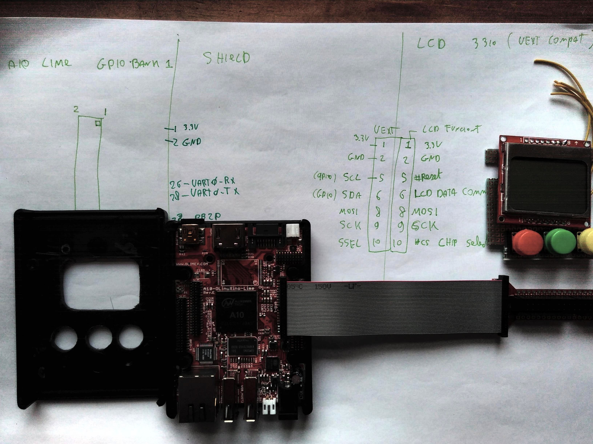

Hardware prototype and debug
============================

After ordering the Lime board and finding a Nokia LCD5110 in my shack it was time 
to prototype and learn about the board itself.

I played with the components to see how they would fit

The first problem I had was that the pin headers of the Lime board are quite small and 
I did not have the possiblity to attach anything to the board. I had to wait and order
the A10-LIME-UEXT `adapter`_ and `cable`_

.. _adapter: https://www.olimex.com/Products/OLinuXino/A10/A10-OLinuXino-LIME-UEXT/open-source-hardware
.. _cable: https://www.olimex.com/Products/Components/Cables/CABLE-40-40-10CM/

UEXT connector
--------------

Olimex defined a very simple connector that can be used to attach many different
devices and created `a spec for it`_.  The connector has support for SPI/I2C/UART and POWER.

.. _a spec for it: https://www.olimex.com/Products/Modules/UEXT/

Schematics
----------

While I did not indend to use the physical connetor it made my job easy for the LCD connector
because if was able to just copy the `MOD-LCD3310-schematics`_ the device should work fine. it halso helped 
me choose witch of the 160 GPIO's to use.

This is the schematics of the MOD-LCD3310 UEXT module

This schematics however does not match what I typically found on other websites like this one for example:

This is (probably becasue) the UEXT module defines that
"The I 2 C signals (SDA and SCL) of host's UEXT are pulled-up with resistors" in it's `UEXT manual`_

The LIME board indeed has this same behaviour

Using the Lime schematics, the schematics of the Lime A10-LIME-UEXT and the schematics of the LCD3310 board I was able to draw
"DaveCAD" style how I wanted the connection to be and I was albe to start prototyping the PCB

In the table bellow shows how I (in the end) ended up connecting the wires to the GPIO1 connector of the UEXT module.
It is lacking a few pullup's as we will see later.

===== ======== === ============= ========== =================
GROUP FUNCTION PIN GPIO1 NAME    GPIO 1 PIN SoC GPIO function
===== ======== === ============= ========== =================
LCD   RST      1   PB20          32
LCD   CE       2   GND  
LCD   DC       3   PB21          30
LCD   DIN      4   MOSI (SPI II) 37
LCD   CLK      5   CLK (SPI II)  35
LCD   VCC      6   3.3v          3
LCD   LIGHT    7   GP10          25         202
LCD   GND      8   GND           2
----- -------- --- ------------- ---------- -----------------
SW    SW1      1   PG7           19         199
SW    SW2      1   PG8           21         200
SW    SW3      1   PG9           23         201
===== ======== === ============= ========== =================

.. _UEXT manual: https://www.olimex.com/Products/Modules/UEXT/resources/UEXT_rev_B.pdf
.. _MOD-LCD3310: https://www.olimex.com/Products/Modules/LCD/MOD-LCD3310/open-source-hardware
.. _MOD-LCD3310-schematics: https://github.com/OLIMEX/UEXT-MODULES/blob/master/MOD-LCD3310/Hardware/MOD-LCD3310-schematic.pdf

The proto PCB
-------------

I started by testing how the components should fit also was drawing schematics to attach the hardware. I was lacking
the connector at that time and was playing with the idea to directly solder the wires to the pin header of the GPIO port.
This was supposed to be a quick and easy side project and I wanted to deliver something working by the end of the week-end.

Fitting the components

After cuting and placing the components I started wireing the PBC and I ended up with something like this

LCD bringup
-----------

Olimex has a great github repository where you can find all the schematics and sample source
code for many devices and modules.

Once the Lime cable arrived I was time to prototype do the hardware brindup and see if my plan worked.

My work started by searching for sample code to talk to the LCD module and I was lucky finding the `A20 MOD-LCD3310`_ sample code this code
depends on SPIDEV being present (see how I enabled this in :doc:`sw_install`.

.. _A20 MOD-LCD3310: https://github.com/OLIMEX/OLINUXINO/tree/master/SOFTWARE/A20/A20-OLinuXino-Micro%20with%20MOD-LCD3310
