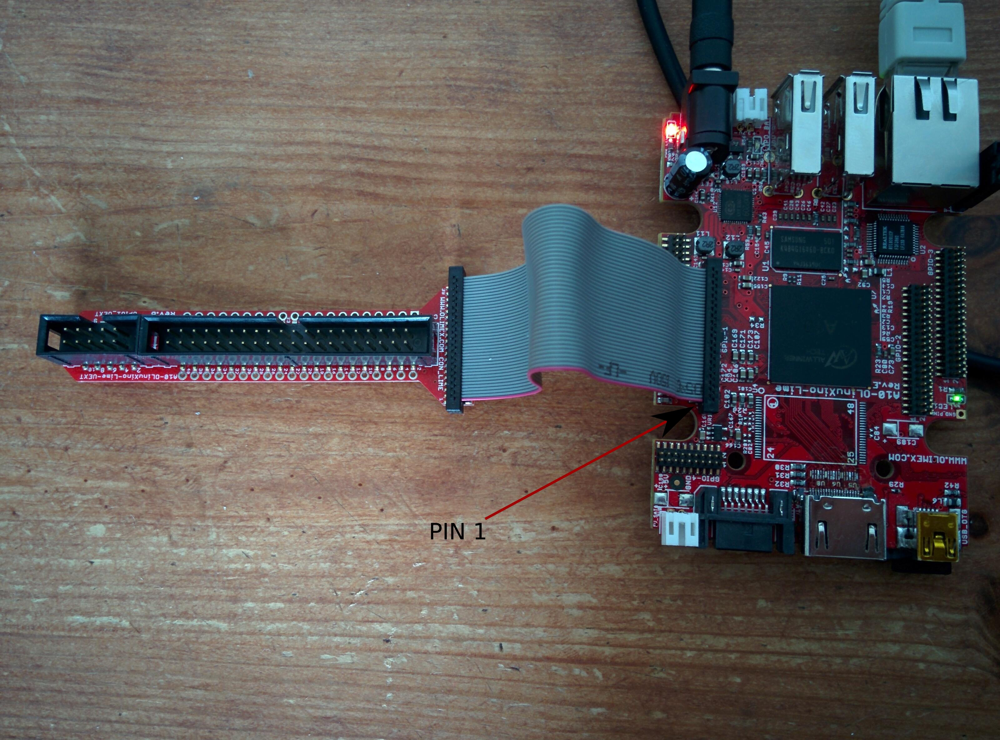
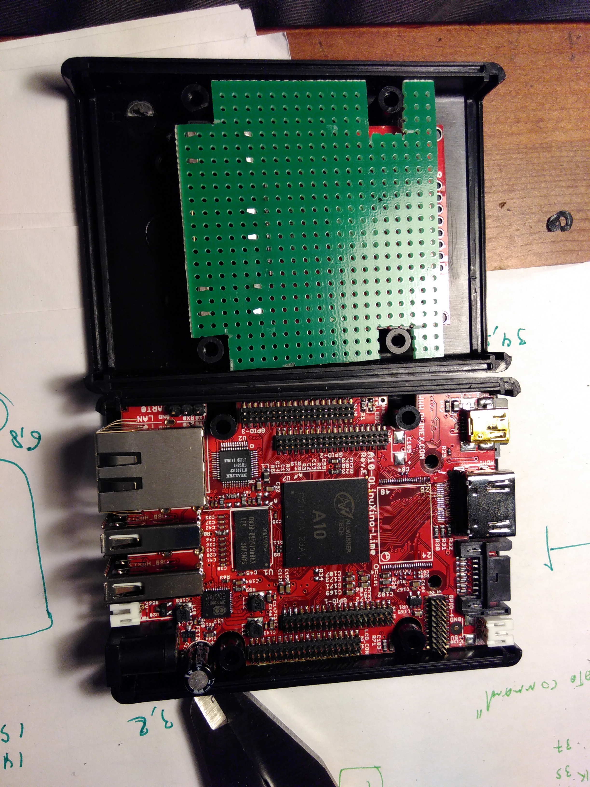

Hardware prototype and debug
----------------------------

After ordering the Lime board and finding a Nokia LCD5110 in my shack it was time 
to prototype and learn about the board itself.

I played with the components to see how they would fit

.. image:: images/proto_case_fit.jpg

The first problem I had was that the pin headers of the Lime board are quite small and 
I did not have the possiblity to attach anything to the board. I had to wait and other
the A10-LIME-UEXT connector and cable

UEXT connector meanwhile
------------------------

Olimex defined a very simple connector that can be used to attach many different
devices and created `a spec for it`_.  The connector has support for SPI/I2C/UART and POWER.
While I did not indend of using the physical connetor it made my job easy for the LCD connector
because if was able to just copy the `MOD-LCD3310-schematics`_ the device should work fine.

.. image:: images/MOD-LCD3310-1_sch.png

This schematics however does not match what I typically found on other websites like this one for example:

.. image:: images/nokialcd3310arduino.png

This is (probably becasue) the UEXT module defines that
"The I 2 C signals (SDA and SCL) of host's UEXT are pulled-up with resistors" in it's `UEXT manual`_

The LIME board indeed has this same behaviour

.. image:: images/lime_gpio1.png

Using the Lime schematics, the schematics of the Lime A10-LIME-UEXT and the schematics of the LCD3310 board I was able to draw
"DaveCAD" style how I wanted the connection to be and I was albe to start prototyping the PCB

.. image:: images/proto/9_proto_pcb_fit.jpg

After cuting and placing the components I started wireing the PBC and I ended up with something like this

.. image:: images/proto/3_proto_closeup.jpg

.. _UEXT manual: https://www.olimex.com/Products/Modules/UEXT/resources/UEXT_rev_B.pdf
.. _MOD-LCD3310: https://www.olimex.com/Products/Modules/LCD/MOD-LCD3310/open-source-hardware
.. _MOD-LCD3310-schematics: https://github.com/OLIMEX/UEXT-MODULES/blob/master/MOD-LCD3310/Hardware/MOD-LCD3310-schematic.pdf

.. _a spec for it: https://www.olimex.com/Products/Modules/UEXT/

Olimex has a great github repository where you can find all the schematics and sample source
code for many devices and modules.

.. image:: images/A10-LIME-UEXT-1.jpg

The goal was to put a display in the box of the Lime I therefore looked at the 
I Also looked 

To properly prototype on the Lime you need an `adapter`_ and a `cable`_!!

.. _adapter: https://www.olimex.com/Products/OLinuXino/A10/A10-OLinuXino-LIME-UEXT/open-source-hardware
.. _cable: https://www.olimex.com/Products/Components/Cables/CABLE-40-40-10CM/

