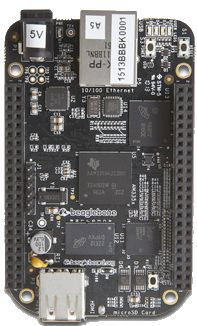
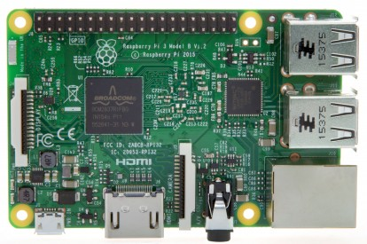
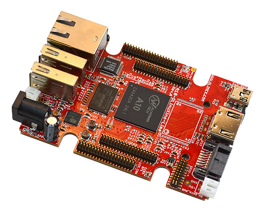

.. A10-OLinuXino-LIME-5510-Shield documentation master file, created by
   sphinx-quickstart on Sat Mar 19 07:43:06 2016.
   You can adapt this file completely to your liking, but it should at least
   contain the root `toctree` directive.

Hardware selection Board
========================

The first step in the project was a part of hardware selection. Here I describe
some considerations.

I wanted a quick and easy project and wanted a run
a batch of about 50 flashing devices. At that rate Money starts counting and
investing a little more time on getting cost down can be beneficial.

Also this being a small sideproject I wanted to use as much open hardware and
software a possible. This allows me to write about what I learned but also,
expecting so spend some evenings on the project, generally make me feel good.

Having spent a considerable amount of time porting
`Minx3 on the BeagleBone Black`_ knowing that the rest of the world loves the
`Raspberry Pi`_ I also wanted to consider using `Olimex`_ hardware beacause of
their open hardware ethics and `my previous work on the A13`_.

.. _Olimex: https://www.olimex/com/
.. _Raspberry Pi: https://www.raspberrypi.org/
.. _Minx3 on the BeagleBone Black: http://wiki.minix3.org/doku.php?id=developersguide:minixonarm
.. _my previous work on the A13: http://keesj.github.io/A13-OlinuXino-playground/

BeagleBone Black
----------------

The `BeagleBoard (TI) community`_ was one of the first real open source hardware
platform. The documentation of the board in excellent and the SoC is VERY well
documented and the community is professional. The device was there before the
Raspberry Pi and starting the BeagleBone black the prices are comparable.

Raspberry Pi
------------

`Raspberry Pi`_ has taken over the world and has become the ducktape for small
projects. It has a large, less professional user community base. It's hardware is
not open nor it there good documentation of the BoardCom SoC. The good thing is
that it is cheap and that every problem you will encouter has already been solved
by somebody else. There are many modules/cases available and I don't have much
experience with the PI. The Raspberry Pi also has know limitations in terms of
`USB capabilities`_

.. _USB capabilities: https://www.raspberrypi.org/documentation/hardware/raspberrypi/usb/README.md

The OLinuXino board family
--------------------------

Olimex produces `open hardware design boards`_ that generally are well priced. I
have  been following their work for quite a while and do like the way they
explain some design consideration in their work. They have different boards and
are not backed by a large company e.g. they are the underdog here. The
`A10-OLinuXino-LIME`_ pictured above is the device I have chosen in the end
for this project.

.. _A10-OLinuXino-LIME: https://www.olimex.com/Products/OLinuXino/A10/A10-OLinuXino-LIME/open-source-hardware
.. _open hardware design boards: https://www.olimex.com/Products/OLinuXino/open-source-hardware

.. _BeagleBoard (TI) community: https://beagleboard.org/

https://www.olimex.com/Products/OLinuXino/open-source-hardware

What board did I choose and why
-------------------------------

Sometimes you make choices based on experience and sometimes you do some research before
you start you project. In this case I needed something fast and needed (as usual?) to make
choices without researching every topic. Questions I asked myself where:

- What is it going to cost
- Are the Hardware/Software and Soc open
- Is it easy to find out the status of the project (kernel/debian)
- Does it have a USB host port and possibly some form of networking
- Does it have a display
- Can the usb port power the attached device

Will any of the boards tick all the boxes? Bellow is a table I made (after the fact) on some things I considered
while shopping around for a board.

============== ===== ======= =============== ============== ============== ================== ================== ===============
Board          Price Case    Mainline Kernel Open Hardware  Documented Soc     Proper USB         Proper OS      Ways to extend
============== ===== ======= =============== ============== ============== ================== ================== ===============
`BBB (black)`_ 59,50 `6,29`_  No             Yes            Yes             musb(not great)   Unclear to me      Capes
`BBB (Green)`_ 42,95 `6,29`_  No             Yes            yes             musb(not great)   Unclear to me      Capes
`RyPi`_        34,95 `6,95`_  No             Nope           Nope            not great         Yes                Lots of capes
`Lime`_        30,00 `5,00`_  Yes!!          Yes            Nope            yes               `Official Debian`_ UEXT/GPIO
============== ===== ======= =============== ============== ============== ================== ================== ===============

I also ordered a smaller `MIPS based board`_/OpenWRT from Olimex to give it a try.
The BeagleBoard did not make it mainly because I have been using it as my main
mail server for the last couple of years and that the debian install on there
is getting so old I can't upgrade it. When going to the beagleboard website it
is just hard to understand what the status is of the project. The USB controller
while functional has know issues. Next I guess I also wanted something new.

I will at some point need to look into the Raspberry Pi but for this project I need
to power phones while flashing the software is it not suitable. It also does not
match what I want from hardware (e.g. to be open). I therefore looked at the
Olimex boards (ranging from the A13, the A10 and the A20). the Lime is a really
small board and the cheapest one was the A10 and it had a nice case.

.. _MIPS based board: https://www.olimex.com/Products/OLinuXino/RT5350F/RT5350F-OLinuXino-EVB/open-source-hardware
.. _BBB (black): https://www.antratek.nl/beaglebone-black-rev-c-2774
.. _BBB (Green): https://www.antratek.nl/beaglebone-green
.. _RyPi: https://www.antratek.nl/raspberry-pi-2-model-b
.. _Lime: https://www.antratek.nl/a10-olinuxino-lime

.. _Official Debian: https://wiki.debian.org/InstallingDebianOn/Allwinner

.. _6,29: https://www.conrad.nl/nl/beaglebone-black-behuizing-1593hambonegy-grijs-792904.html
.. _6,95: https://www.sossolutions.nl/b-behuizing-eigen-merk-aanrader-trans?fee=4&fep=82?utm_source=shopping&utm_medium=adwords&utm_term=B+%20en%202B%20Behuizing%20eigen%20merk%20%28aanrader%29%20-%20TRANSPARANT&utm_campaign=shopping&gclid=CPSzg_aH0MsCFdQaGwodZ0gHRA
.. _5,00: https://www.antratek.nl/a10-olinuxino-lime-box

.. toctree::
