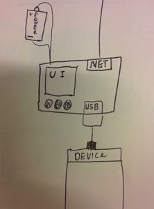

Hardware selection UI
=====================

For flashing the devices it is very nice if you can have some form of UI and there are many ways
of getting there

Output:

- Attach the device to a HDMI screen
- Attach LEDs to the board
- Attach an LCD screen or 7-segment display
- Run a web server and access the UI on a phone or similar
- Use sound as output

Input:

- No input, just flash what is on the system
- Use different USB keys or MMC cards to flash different software
- Add buttons to the design
- Allow the device to connect to a server and configure the device online
- Run a web server

The Choice of UI
----------------

I looked at the different options and sometimes came up with more options but in
the end I wanted something
that can work standalone. Ohter possibilities like runing a webserver where not
feasible because one also then needs do networking (and thus also the IP address
of the device).

I also looked at using the HDMI port and hooking a keyboard to the device but
that really started to become a cumbersome project(We might as well provide
documentation on flashing devices from a standard PC).

I therefore settled for adding a screen and a few buttons to the flashing device

.. toctree::
