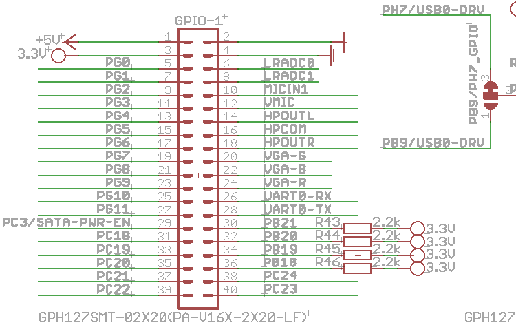

Project Wrapup
===============

Now the project is mostly done I must say I am quite happy with my choice of the
Olimex board. It provided a cheap "industry grade" professional building block
for small "embedded" project.

Debian Jessie is officially supported on the board I just wish Olimex provided
that version by default as I lost quite some time doing the upgrade.
The AllWinner chipset has very poor documentation and it would
be nearly impossible to get something like Minix3 running on it. Therefore the
SoC does not match what I would like from a system on chip. Still that said the
community around the soc (@TODO sunx-??? irc freenode and website) did so much
work on the chip that for the first time in my life I was able to download &
build a mainline "Linus" vanilla kernel and get it booting without any patches.
That said not all hardware is enabled by default and enabling hardware is pretty
hard because it all depends on modifying the device tree.

I have been lucky with the SPI implementation and the choice of hardware.
The mainline kernel for the A10 has a limitation of 64 bytes spi packets and had
I used a real LCD screen I would have got into trouble.

UEXT
----

The UEXT extension model of Olimex remains simple and effective. Put a few low
pin count interfaces on a module (SPI/I2C and and UART) and power and make sure
the pins can also be accessed as GPIO. For the Lime board this helped me choose
what pins to use for the LCD display. I was also able to look at schematics
of for example the Nokia 3310 UEXT module sold by olimex. There are a few weird
things with it the pull up resistors on pins BP21 BP20 BP19 and PB18.

Device tree
-----------
