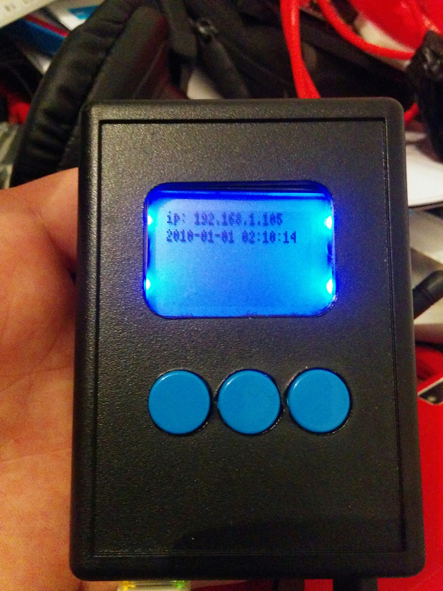

Software ui
===========

After some more hacking the framebuffer was ready and it was time to create
a simple UI. I have choosen the pygame framework and found a nice way of displaying
content on the screen.

Small fonts
------------
Given the small size of the display I had to find a small font to fit on the screen. After messing arround
with `bmpfont`_ I found that `fine`_ had a nice font in the bdf format supported by pygame through freetype.

Getting rid of the cursor in directfb
-------------------------------------

Given my previous edit of the directfbrc I expected no curstor to be visible. It turns out pygame 
was displaying a curstor on my small screen.

fixing the problem was really easy::

	pygame.mouse.set_visible(False)

.. _bmpfont: http://www.pygame.org/pcr/bitmap_font/index.php
.. _fine: http://hea-www.harvard.edu/~fine/Tech/x11fonts.html

The first Thing I wanted was to display the IP address of the machine and be able to update
the screen the following code is like the first work in progress UI(only one game state)::

	class UI:
		def __init__(self):
			pygame.init()
			pygame.mouse.set_visible(False)
			self.screen = pygame.display.set_mode((84, 48), 0, 16)
			font_file  = os.path.join(os.path.dirname(__file__), 'assets/atari-small.bdf')
			self.font = pygame.font.Font(font_file,8)

			self.background = pygame.Surface(self.screen.get_size())
			self.background = self.background.convert()
			self.background.fill((0, 0, 0))
			self.ip_count = 0
			self.ip_status = "Unknown"

		def mainUiLoop(self):
			self.screen.blit(self.background, (0, 0))

			#
			# Premature optimization is the root of all evil
			#
			if self.ip_count % 10 == 0:
				if (is_up('eth0')):
					self.ip_status = "ip: %s" % get_ip_address('eth0')
				else:
					self.ip_status = "ip: Not connected"

			self.ip_count = self.ip_count +1
			
			txt = self.font.render(self.ip_status, True, (255,255,255))
			self.screen.blit(txt,(0,0))

			msg = datetime.datetime.strftime(datetime.datetime.now(), '%Y-%m-%d %H:%M:%S')
			txt = self.font.render(msg, True, (255,255,255))
			self.screen.blit(txt,(0,9))
			pygame.display.flip()

	if __name__ == "__main__":
		import os
		import pygame
		from twisted.internet.task import LoopingCall
		from twisted.internet import reactor
		import datetime

		from subprocess import call
		from pygame.locals import *

		
		if os.getuid() == 0:
			print ("Haha n33b you are running as root")
			os.system("echo 1 > /sys/class/backlight/fb_pcd8544/bl_power")

		ui = UI()
		tick = LoopingCall(ui.mainUiLoop)
		tick.start(1.0 / 5)
		
		reactor.run()
